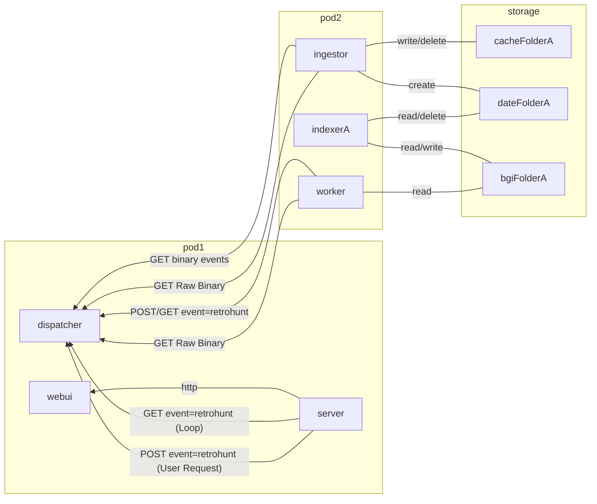
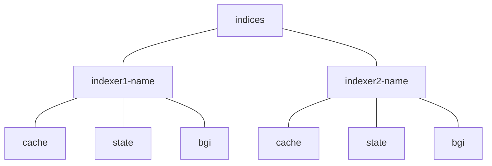
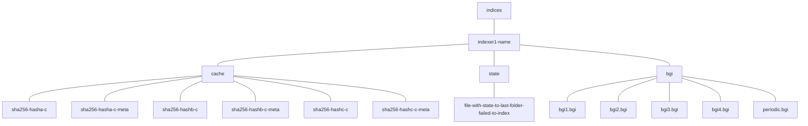
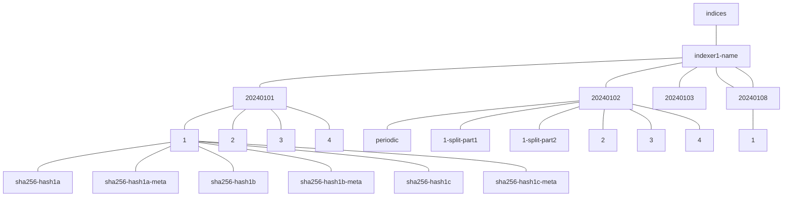
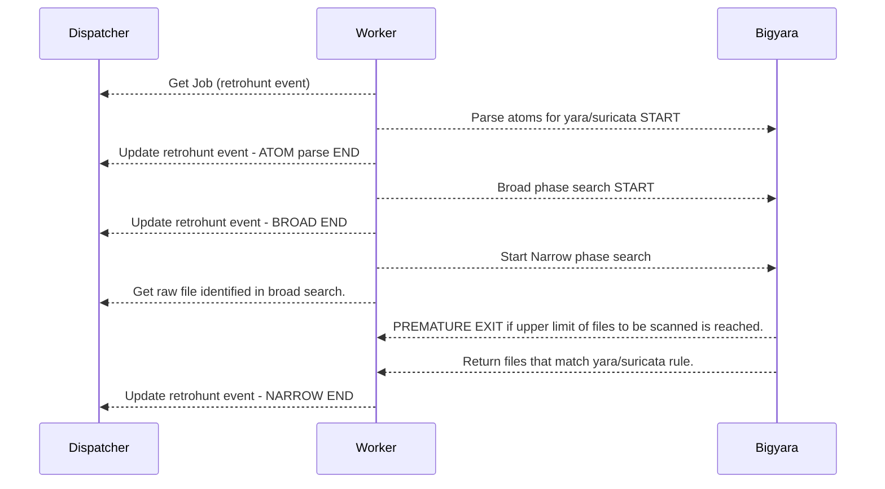
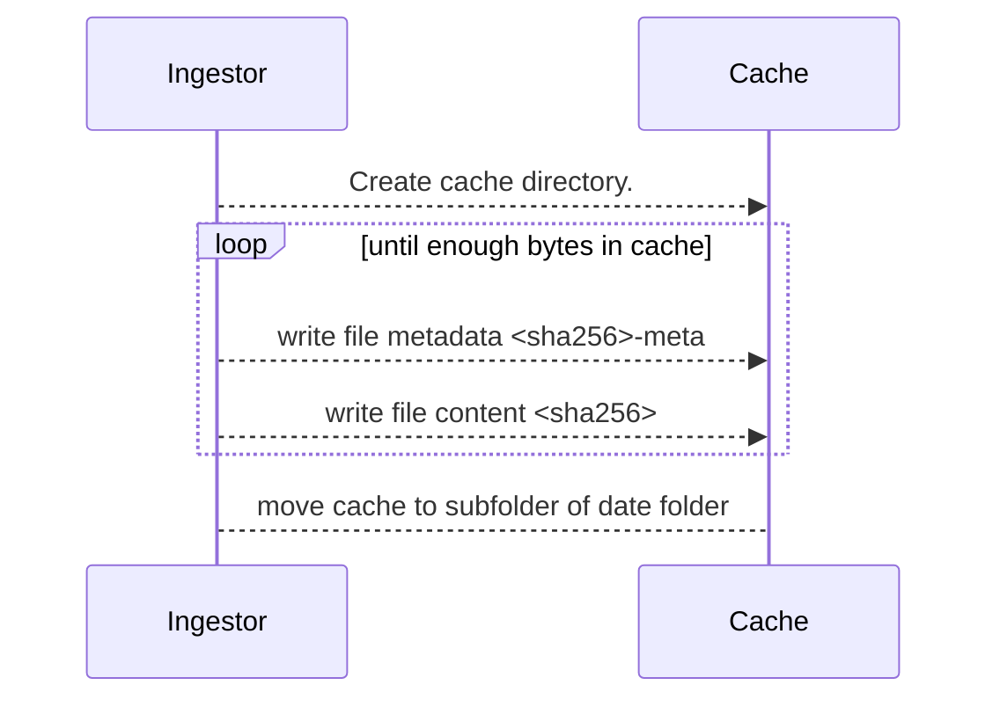
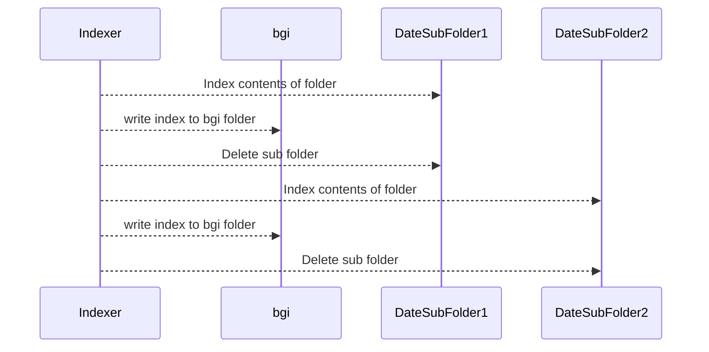

# Azul Plugin Retrohunt

AZUL plugins for indexing and querying historical samples with yara and suricata queries.

This leverages the capabilities of Cert's BigGrep indexing.

## Summary

### This project consists of 4 parts:

#### azul-plugin-retroingestor:

- ingests binaries from azul binary_sourced and derived events.
- ingested binaries are placed in a folder structure ready for indexing by the retroindexer.

#### azul-plugin-retroindexer:

- Uses biggrep to index directories that are marked as ready for indexing by retroingestor.
- Indexed files are deleted and the resulting index put in a specific directory, ready for retroworker to read from.

#### azul-plugin-retroworker:

- subscribes to dispatcher and accepts `retrohunt` events submitted to dispatcher.
  Upon receiving an event it runs across all available big grep indexes with the provided yara/suricata rule.
- Once an event's rules have been run it posts a result back to dispatcher.
- Single threaded and will only run one job at a time, if you want more jobs running. Run more instances.

#### azul-plugin-retroserver:

- Accepts yara/suricata rules from users and submits `retrohunt` events to dispatcher for retroworker to accept.
- Displays the resulsts or retrohunt workers jobs.

## Installation

- Install required system libraries:
  `xargs sudo apt-get install < debian.txt`

- Install required python libraries:
  `pip install -r requirements.txt`

- Download, patch and compile required projects:
  `make`

- Install package (from the root directory of this project):
  `pip install -e .`

### Installation debugging

If you are having problems with bigyara after install you may need to install a specific version of boost which will
be listed as an unfound \*.so file in the error.
To do this you can go to this webite (https://sourceforge.net/projects/boost/files/boost) and find the appropriate
version and download it with wget.

```bash
wget -o=boost_download.tar.gz https://sourceforge.net/projects/boost/files/boost/...
tar xzvf boost_download.tar.gz
cd boost_1_x_x/
# Compile and install package
./bootstrap.sh --prefix=/usr/
./b2
sudo ./b2 install
```

## Usage

### Config options

Configuration is done for all indexer/ingestor and worker components through a single pydantic settings object.
That loads environment variables.
To see the most up to date options check the settings.py file.

The current options (in yaml) are as follows:

```yaml
PLUGIN_ROOT_PATH: "/tmp" # Root directory for the worker, indexers and ingestor to run from.
PLUGIN_EVENTS_URL: "http://localhost:8111" # dispatcher's events url
PLUGIN_DATA_URL: "http://localhost:8111" # dispatcher's streams url
PLUGIN_INDEXERS:
  example:
    name: "example" # Name of this indexer (must match the command line arg that azul-plugin-retroindexer needs.)
    stream_labels: # Azul stream labels this indexer should accept.
      - "content"
    max_bytes_before_indexing: "10GiB" # Number of bytes in a folder before it should be indexed.
    timeout_minutes: "60" # How long an indexer can run before timing out.
    periodic_index_frequency_min: "60" # How many minutes to wait between periodically indexing the current content (0 or less to disable.)
    run_once: "False" # Typically always false
  example2:
    name: "example2"
    stream_labels:
      - "content"
    max_bytes_before_indexing: "10GiB"
    timeout_minutes: "60"
    run_once: "False" # Typically always false
```

## Usage: azul-plugin-retroingestor

```
azul-plugin-retroingestor
```

## Usage: azul-plugin-retroindexer

NOTE - the indexer name must match whatever the key value in the PLUGIN_INDEXERS is to load that indexers config.

```
azul-plugin-retroindexer --indexer-name example
```

## Usage: azul-plugin-retroworker

```
azul-plugin-retroworker
```

## Usage: azul-plugin-retroserver

A simple webserver for submitting and querying retrohunt searches.

Kafka is used as an IPC mechanism and state store.

```
azul-plugin-retroserver --host 0.0.0.0 --port 8882
```

### Command Args

| Arg Name | Default                | Valid Values          | Description                                                        |
| -------- | ---------------------- | --------------------- | ------------------------------------------------------------------ |
| host     | 0.0.0.0                | \<interface_address\> | Network interface address to listen on.                            |
| port     | 8852                   | \<int\> port          | The port number to listen on.                                      |
| reload   | True                   | 0 or 1                | Should the server watch and reload when code changes are detected. |
| server   | https://localhost:8111 | \<dispatcher_url\>    | Azul Dispatcher URL to send/receive events.                        |
| links    |                        | \<url_prefix\>        | A URL to prefix any sample hashes, in results, into hyperlinks.    |

## Summary diagram for retrohunt

### Pod Overview

Pods and PVC's and communication between the two that form retrohunt.

NOTE - there can be multiple indexers which will have there own folders.
When that is the case the ingestor and worker can talk to all copies of the big, cache and date folders.
The indexers can only talk to their own date and bgi folders and not each others.



### Storage format

File directory structure of retrohunt.

The structure is all under the indices directory with the first level down being the name of an indexer.

#### Below the indexer's name there are 3 system folders:

- cache: stores files that have been ingested but are not ready for indexing because the file size is still too small.
- bgi: stores bgi files that are a completed indices ready to be used by a worker.
- state: used to store state information, which is useful to escape OOM failures or files that can't be indexed.

System files with two indexers:



---

System files with generic content:



#### Date Named Folders

The date named folders are named based on the current year, month, day and hour.
These store sub folders that are ready for indexing.

They are stored at the same level as the system folders (bgi, cache, state)

The sub folders of the date files are named in the order they were created (1 ascending). Below these folders are the files and their metadata ready to be indexed.

There can also be -split-partX sub folders with content.
These are folders that have failed indexing once and contents of the file were split in half and placed in two sub folders.

This is done to handle Out of memory failures if there are too many files or bad types of files in a folder ready for indexing.

If a split folder also fails to index it is not split again but simply deleted.



### Bigyara & worker

The processing order of retrohunt-worker and how it communicates with BigYara and dispatcher.



## Indexing and cache.

The ingestor and indexer are designed to be run at the same time and reading and writing to the same file system.

To prevent the indexer and ingestor from writing to the same directory they operate on different directories at all times.

The ingestor only writes to cache and when the cache is big enough it moves it to a subfolder of a date folder (it'll create the date folder if needed.)

The ingestor also periodically deletes date folders with no content.
Date folders have no content once indexer has indexed all the sub directories in that folder.

Ingestor sequence



Indexer sequence



## Special case - periodic file

Once an hour the indexer will generate a folder named "periodic" which contains a copy of everything currently in cache which hasn't been indexed yet.
Indexer will index that directory into a bgi file called periodic.bgi.

The hour after that when periodic is re-generated the periodic, the indexer will replace the old periodic.bgi file with the newly generated one.

# BigYara

````
### Searching

All searching takes place from the `search` function in `bigyara.search`.

```python
from bigyara.search import QueryTypeEnum, search

results: dict[str, list[str]] = search(yara_rule, QueryTypeEnum.STRING, directory)
````

Yara searches can also be conducted via the command line. You can run `bigyara -h` to see its usage instructions. The basic Yara search usage is:

```bash
python bigyara -d <directory containing indices> yara_file.yar
```

This will search for all the files in the indices in `<index location>` that match `yara_file.yar`.

```
Searching Indices: 100% 1340 of 1340 |###################################################################| Time: 0:00:08
my_rule_1:
  /path/to/match/file1
  /path/to/match/file2
  /path/to/match/file3
my_rule_2:
  /path/to/match/file4
  /path/to/match/file5
my_rule_3:
  /path/to/match/file6
Running Yara: 100% 186 of 186 |###################################################################| Time: 0:00:03
```

The progress bars are written to stderr, so you can pipe stdout to a file and only get the list of matches.

## Python Package management

This python package is managed using a `setup.py` and `pyproject.toml` file.

Standardisation of installing and testing the python package is handled through tox.
Tox commands include:

```bash
# Run all standard tox actions
tox
# Run linting only
tox -e style
# Run tests only
tox -e test
```

## Integration tests

To run the integration tests locally use the script:

```bash
# start the redis server
docker compose up
# run the tests
./tests/run_integration_tests.sh
```

## Dependency management

Dependencies are managed in the requirements.txt, requirements_test.txt and debian.txt file.

The requirements files are the python package dependencies for normal use and specific ones for tests
(e.g pytest, black, flake8 are test only dependencies).

The debian.txt file manages the debian dependencies that need to be installed on development systems and docker images.

Sometimes the debian.txt file is insufficient and in this case the Dockerfile may need to be modified directly to
install complex dependencies.
